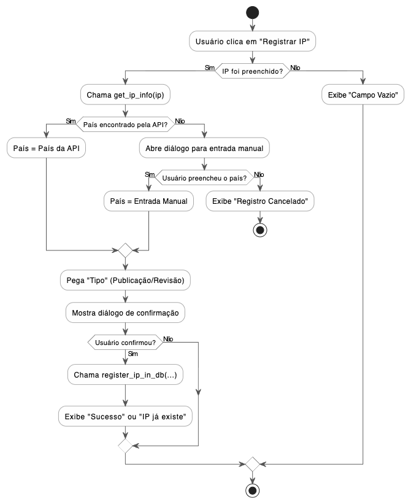

# Projeto Registrador de IP 🕵️‍♂️

Aplicação de desktop para gerenciamento de IPs, implementando extração de dados via OCR (Tesseract) e persistência em banco de dados PostgreSQL.

**CURSO:** ENGENHARIA DE SOFTWARE
**PERÍODO:** 5º Período
**DISCIPLINA:** [SUA DISCIPLINA AQUI (ex: DESENVOLVIMENTO DE SOFTWARE)]
**PROFESSOR:** [NOME DO SEU PROFESSOR AQUI]

---

## 🎯 Objetivo do Projeto

Desenvolver uma aplicação desktop com interface gráfica (GUI) que permita a um usuário registrar e consultar endereços IP. O objetivo principal é agilizar o fluxo de trabalho do usuário, permitindo que o sistema extraia automaticamente um IP de uma captura de tela (print screen) colada diretamente na aplicação.

---

## ⚙️ Lógica da Aplicação Implementada

A lógica central do sistema é dividida em dois fluxos principais: a extração de dados por OCR e o registro de dados com fallback.

### 1. Fluxo de Extração de IP via OCR

O sistema captura o evento `Cmd+V` (colar) em toda a aplicação. A lógica de tratamento segue estes passos:

* **1. Tentativa de Colar Texto:** O sistema primeiro verifica se o conteúdo da área de transferência é um texto.
    * **Se sim:** O texto é analisado com a expressão regular (Regex) `r'\b(?:\d{1,3}\.){3}\d{1,3}\b'`.
    * **Se um IP for encontrado:** O campo de entrada é preenchido com o IP e o fluxo termina.
* **2. Tentativa de Colar Imagem:** Se o conteúdo não for texto, o sistema tenta lê-lo como uma imagem (`ImageGrab.grabclipboard()`).
    * **Se for uma imagem:** A imagem é enviada para o motor Tesseract (`pytesseract.image_to_string()`).
    * **Se o Tesseract extrair texto:** O texto resultante é analisado pela *mesma* expressão regular (Regex) para encontrar um IP.
    * **Se um IP for encontrado:** O campo de entrada é preenchido.

### 2. Fluxo de Registro com Fallback de API

Ao clicar em "Registrar", o sistema enriquece os dados antes de salvar:

* **1. Busca na API:** O sistema consulta a API `ip-api.com` para obter o país associado ao IP.
* **2. Verificação (Fallback):** O sistema verifica se a API retornou um país.
    * **Se não (ex: IP privado como 192.168.1.1):** Uma nova caixa de diálogo (`PasteEnabledInputDialog`) é aberta, solicitando que o usuário digite o país manualmente.
    * **Se o usuário cancelar:** O registro é interrompido.
* **3. Confirmação e Registro:** Com todos os dados (IP, Código Mobile, País, Tipo), uma confirmação é exibida. Se o usuário aceitar, os dados são enviados ao PostgreSQL (`register_ip_in_db`).

---

## 🚀 Como Executar o Projeto

Para executar o projeto localmente, são necessários pré-requisitos de sistema e a configuração do banco de dados.

### 1. Pré-requisitos do Sistema

* **PostgreSQL:** O servidor de banco de dados precisa estar instalado e rodando.
* **Tesseract OCR:** O motor de OCR. No Mac, a instalação é via Homebrew:
    ```bash
    brew install tesseract
    ```

### 2. Configuração do Banco de Dados

1.  Crie um banco de dados no PostgreSQL (ex: via `pgAdmin`). O nome padrão esperado é:
    `ip_tracker`
2.  Execute o script SQL abaixo para criar a tabela:
    ```sql
    CREATE TABLE registered_ips (
        id SERIAL PRIMARY KEY,
        ip_address VARCHAR(45) NOT NULL UNIQUE,
        mobile_code VARCHAR(10),
        country VARCHAR(100),
        registration_date TIMESTAMPTZ DEFAULT NOW(),
        record_type VARCHAR(20) NOT NULL DEFAULT 'Publicação'
    );
    ```

### 3. Instalação e Execução

1.  Clone o repositório e navegue até a pasta:
    ```bash
    git clone [https://github.com/SEU_USUARIO/SEU_REPOSITORIO.git](https://github.com/SEU_USUARIO/SEU_REPOSITORIO.git)
    cd nome-do-projeto
    ```
2.  Crie o arquivo `.env` na raiz do projeto para suas credenciais do banco:
    ```ini
    DB_USER="postgres"
    DB_PASSWORD="sua_senha_secreta_aqui"
    DB_HOST="localhost"
    DB_PORT="5432"
    DB_NAME="ip_tracker"
    ```
3.  Crie e ative um ambiente virtual:
    ```bash
    python3 -m venv .venv
    source .venv/bin/activate
    ```
4.  Instale as dependências:
    ```bash
    pip install -r requirements.txt
    ```
5.  Execute o script `main.py` (o lançador):
    ```bash
    python main.py
    ```
------------------------------------------

## 📊 Diagrama de Fluxo - Registro de IP

Diagrama visual (gerado com PlantUML) demonstrando o fluxo de lógica ao clicar no botão "Registrar IP".

